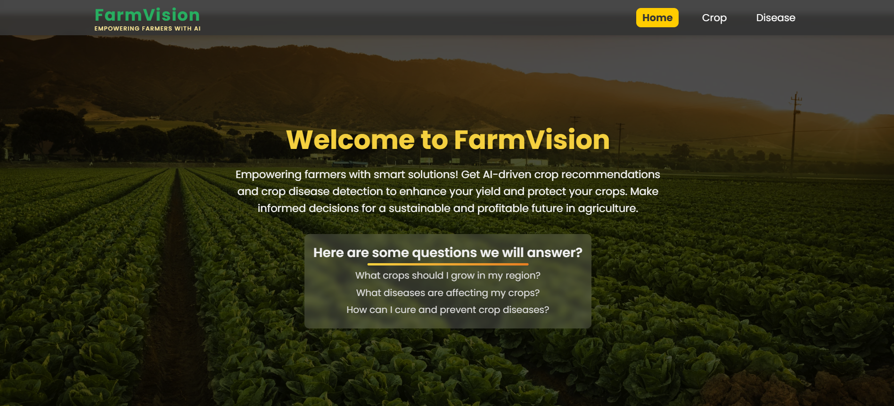
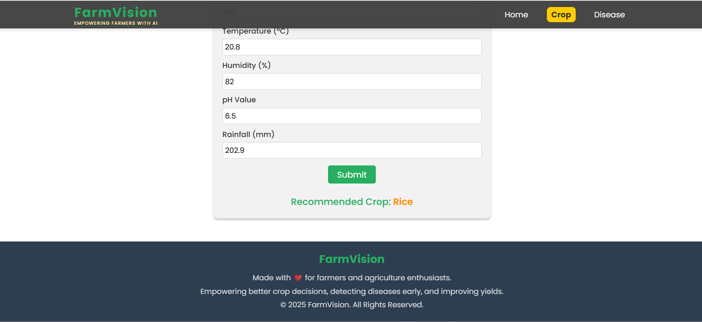
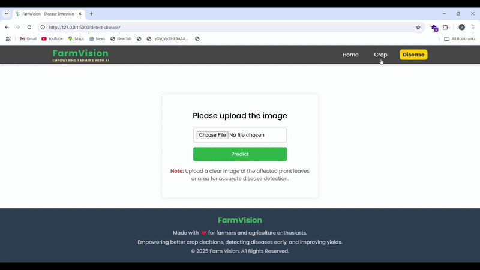

# FarmVision 🌾


## Project Overview
A machine learning and deep learning-based website that recommends the best crop to grow based on soil conditions, including nutrient levels and environmental factors, while also detecting diseases in crops and providing detailed step-by-step guidance on how to cure them effectively.

## Disclaimer ⚠️
This is a proof-of-concept (POC) project. The data used here does not come with any guarantee from the creator. This project is intended to showcase how AI can be used in precision farming if developed on a larger scale with authentic and verified data.

## Motivation 💡
Agriculture plays a crucial role in the economy and sustenance of many countries. Leveraging modern technologies like Machine Learning and Deep Learning can help farmers optimize their yield and detect diseases early.
FarmVision aims to assist farmers by providing:

- **Crop Recommendation**: Suggesting the best crops to grow based on soil nutrients.

- **Disease Detection**: Identifying plant diseases through image classification and providing recommendations for treatment.
- **Disease Prevention**: Offering preventive measures to protect crops from potential diseases and ensure healthier yields.

## Features 🚀
### Crop Recommendation System 🌱
- Users can enter soil nutrient values (N-P-K) to receive recommendations on the most suitable crops.
- Uses a trained machine learning model to predict crop suitability.

### Crop Disease Detection 🦠
- Users can upload an image of a crop leaf.
- The deep learning model analyzes the image and predicts whether the plant is healthy or diseased.
- If diseased, the system provides details about the disease, its causes, and possible cures.

## Data Source 📊
- [Crop Recommendation dataset](https://www.kaggle.com/code/niteshhalai/crop-recommendation-dataset/input)
- [Crop Disease Dataset](https://www.kaggle.com/datasets/mohitsingh1804/plantvillage)

## Technologies Used


## How to Run Locally 🛠️
Ensure you have Git and Python installed before proceeding.
```
# Clone the repository
git clone https://github.com/vamshigoud1108/FarmVision.git

# Navigate to project folder
cd FarmVision

# Create and activate virtual environment
python -m venv myenv

# Install dependencies
pip install -r requirements.txt

# Run the application
python app.py
```
Once the app is running, open http://127.0.0.1:5000/ in your browser to access FarmVision.

## Example Usage 📝
### Crop Recommendation
- **Scenario**: A farmer wants to know which crop is best suited for their soil.
- **Steps**: 
1. Enter soil values such as Nitrogen (N), Phosphorus (P), and Potassium (K).
2. Click on the "Recommend Crop" button.
3. The system provides the most suitable crop based on the soil data.


### Disease Detection
- **Scenario**: A farmer notices unusual spots on their crop leaves.
- **Steps**:
1. Upload a clear image of the affected crop leaf.
2. Click on the "Detect Disease" button.
3. The system classifies the disease and provides cure recommendations.



## Future Improvements 📈
- **Fertilizer Recommendation**: Implement a system that suggests fertilizers based on soil deficiencies.
- **Weather Integration**: Incorporate real-time weather data to enhance crop recommendations.
- **Multi-Language Support**: Provide an interface in multiple languages for better accessibility.
- **Yield Prediction**: Implement a model to estimate the expected yield based on environmental and soil conditions.

## Contributing 🤝
Contributions are welcome! If you'd like to improve FarmVision, feel free to fork the repository, make changes, and submit a pull request.

## Contact 📞
For questions or contributions, reach out via ([Email](vamshiramagoni3@gmail.com))or connect on ([LinkedIn](https://www.linkedin.com/in/vamshi-ramagoni-b015b9257/)).

## Thank You! 🙏
Thank you for exploring FarmVision, I appreciate your support and interest in this project. Together, we can make technology more accessible to farmers and enhance agricultural productivity.

